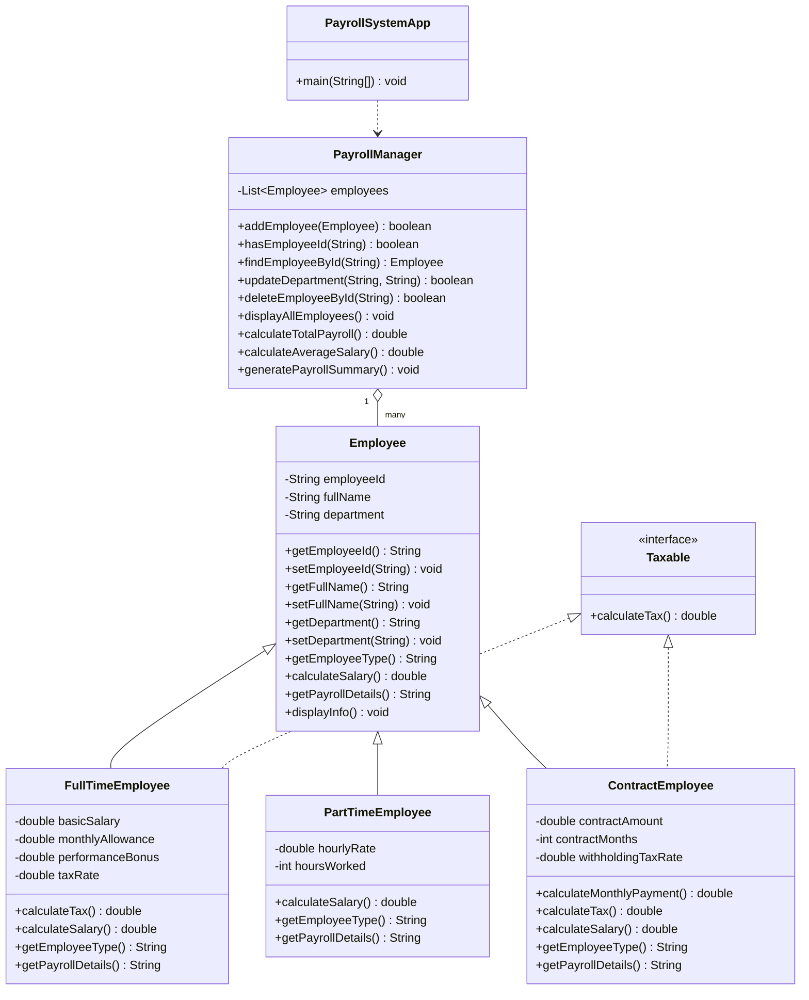

# Employee Payroll System (Java Console Application)
---

## 1. Project Overview
This project is a console-based Employee Payroll System developed in Java to demonstrate core Object-Oriented Programming (OOP) concepts and basic Java control structures.

The system supports payroll management for three employee categories:
- Full-Time Employee
- Part-Time Employee
- Contract Employee

---

## 2. Objectives
- Apply OOP principles in a real use case.
- Build a structured payroll program using Java classes and interfaces.
- Handle user input and menu-driven actions in a console environment.
- Perform salary calculations with consistent financial rounding.

---

## 3. Features Implemented
1. Add Full-Time Employee
2. Add Part-Time Employee
3. Add Contract Employee
4. Display All Employees (sorted by Employee ID)
5. Search Employee by ID
6. Update Employee Department
7. Generate Payroll Summary
8. Delete Employee by ID (with confirmation)
9. Exit Program

Additional quality improvements:
- Optional sample data preload at startup
- Input validation for empty fields, numeric values, rates, and positive integers
- Payroll summary includes total, average, highest salary, and lowest salary
- Currency calculations use 2-decimal financial rounding

---

## 4. OOP Concepts Demonstrated

### Class and Object
Multiple classes are used to model payroll operations and employee entities.

### Encapsulation
Fields are private and controlled via getters/setters with validation logic.

### Inheritance
`FullTimeEmployee`, `PartTimeEmployee`, and `ContractEmployee` inherit from abstract class `Employee`.

### Polymorphism
Each employee type overrides `calculateSalary()` and provides its own salary logic.

### Abstraction
`Employee` is abstract and defines common behavior for all employee types.

### Interface Usage
`Taxable` interface is implemented by taxable employee categories.

---

## 5. Project Structure (Source Code)

```text
Console-/
|- src/
|  |- Employee.java
|  |- Taxable.java
|  |- FullTimeEmployee.java
|  |- PartTimeEmployee.java
|  |- ContractEmployee.java
|  |- PayrollManager.java
|  |- PayrollSystemApp.java
|- README.md
```

---

## 6. Class Responsibilities
- `Employee.java`: Abstract base class with common fields and methods.
- `Taxable.java`: Interface defining tax behavior.
- `FullTimeEmployee.java`: Salary and tax calculation for full-time staff.
- `PartTimeEmployee.java`: Salary calculation based on hourly work.
- `ContractEmployee.java`: Monthly contract payment and withholding tax calculation.
- `PayrollManager.java`: Core business logic (add, search, update, delete, summary).
- `PayrollSystemApp.java`: Console menu and user interaction flow.

---

## 7. UML Class Diagram



---

## 8. Compile and Run

### Compile
From the `src` folder:

```bash
javac *.java
```

### Run (Option 1)
From the `src` folder:

```bash
java PayrollSystemApp
```

### Run (Option 2)
From the project root:

```bash
java -cp src PayrollSystemApp
```

---

## 9. Sample Output (Short)

```text
============================================================
Welcome to Employee Payroll System
============================================================
Load sample employees for demo? (y/n): y
Sample data loaded successfully.

============================================================
	EMPLOYEE PAYROLL SYSTEM (JAVA CONSOLE APP)
============================================================
1. Add Full-Time Employee
2. Add Part-Time Employee
3. Add Contract Employee
4. Display All Employees
5. Search Employee by ID
6. Update Employee Department
7. Generate Payroll Summary
8. Delete Employee
9. Exit
============================================================
```

---

## 10. Conclusion
The Employee Payroll System successfully demonstrates OOP principles in Java through a practical and structured payroll application. The system is modular, readable, and suitable for academic submission with complete core functionality and validation.

---

- [ ] Source code uploaded successfully

